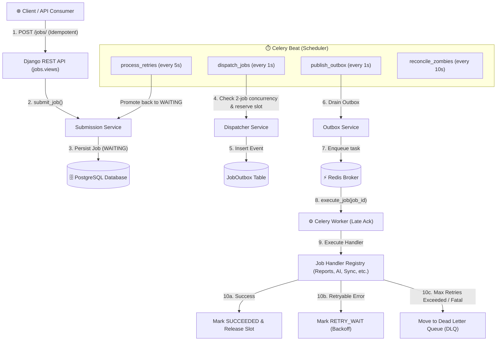

# Multi-Tenant Background Job Orchestrator

A high-performance, fault-tolerant, enterprise-grade multi-tenant asynchronous job processing and orchestration service built with **Python**, **Django**, **Django REST Framework (DRF)**, **PostgreSQL**, **Redis**, and **Celery**.

---

## Table of Contents

- [Overview & Key Features](#overview--key-features)
- [System Architecture](#system-architecture)
  - [High-Level Architectural Workflow](#high-level-architectural-workflow)
  - [Core Components](#core-components)
  - [Job Lifecycle State Machine](#job-lifecycle-state-machine)
- [Project Directory Structure](#project-directory-structure)
- [Used Libraries & Dependencies](#used-libraries--dependencies)
- [Prerequisites & Environment Setup](#prerequisites--environment-setup)
  - [1. Prerequisites](#1-prerequisites)
  - [2. Clone & Virtual Environment Setup](#2-clone--virtual-environment-setup)
  - [3. Install Dependencies](#3-install-dependencies)
  - [4. Environment Variables (`.env`)](#4-environment-variables-env)
  - [5. Database Migrations](#5-database-migrations)
- [Running the Application](#running-the-application)
  - [1. Run Django API Server](#1-run-django-api-server)
  - [2. Run Celery Worker](#2-run-celery-worker)
  - [3. Run Celery Beat Scheduler](#3-run-celery-beat-scheduler)
- [Running Tests](#running-tests)
  - [Full Test Suite](#full-test-suite)
  - [Test Modules Breakdown](#test-modules-breakdown)
- [API Reference](#api-reference)
  - [Tenant Endpoints](#tenant-endpoints)
  - [Job Endpoints](#job-endpoints)
  - [Dead Letter Queue (DLQ) Endpoints](#dead-letter-queue-dlq-endpoints)
  - [Sample Requests](#sample-requests)

---

## Overview & Key Features

This platform is engineered to manage millions of background jobs across thousands of independent tenants with strict fairness, isolation, and resilience guarantees:

1. **Per-Tenant Concurrency Throttling**:
   - Strictly limits each tenant to a maximum of **2 concurrent executing jobs** at any given time.
   - Additional jobs remain safely in `WAITING` status without blocking other tenants.

2. **Priority-Driven Scheduling (1 to 5)**:
   - Priority scale from `1` (Highest / Critical) down to `5` (Lowest / Background).
   - Deterministic FIFO ordering within the same priority level via `ready_since` timestamp tracking.

3. **Strict Idempotency & Deduplication**:
   - Prevents duplicate job creation caused by client retries, proxy timeouts, or network glitches.
   - Enforced by a database-level unique constraint on `(tenant_id, idempotency_key)`.

4. **Transactional Outbox Pattern**:
   - Ensures zero message loss. Job dispatch events are staged inside PostgreSQL within the same ACID transaction as the state change and published asynchronously to Redis/Celery.

5. **Configurable Retries & Dead Letter Queue (DLQ)**:
   - Differentiates between transient failures (`RetryableJobError` &rarr; exponential backoff in `RETRY_WAIT`) and fatal failures (`PermanentJobError` &rarr; direct routing to DLQ).
   - Once maximum retry limits are exceeded, failed jobs transition to `FAILED_FINAL` and create a `DeadLetterJob` record for administrative diagnosis and replay.

6. **Worker Crash Recovery & Zombie Lease Reconciliation**:
   - Celery tasks run with `acks_late=True` and `reject_on_worker_lost=True`.
   - Active execution leases are heartbeated; if a worker dies mid-job, the periodic `reconcile_zombies` task detects expired leases and reclaims the reservation slot.

7. **Overlap Prevention**:
   - Fine-grained mutual exclusion locks based on scopes (e.g. `TENANT_JOB_TYPE` or custom resource keys) to prevent duplicate runs of identical processing routines.

---

## System Architecture

### High-Level Architectural Workflow



### Core Components

| Component | Technology | Responsibility |
|---|---|---|
| **API Layer** | Django 6 + DRF | Handles HTTP requests, authentication, tenant CRUD, job dispatching, cancellation, and DLQ diagnostics/replays. |
| **Primary Storage** | PostgreSQL | Holds relational models, ACID transactions, execution reservations, outbox logs, and dead-letter records. |
| **Message Broker** | Redis | High-throughput broker used by Celery for message delivery and coordination. |
| **Task Queue & Workers** | Celery | Processes background tasks asynchronously using late acknowledgments (`acks_late=True`). |
| **Scheduler** | Celery Beat | Drives periodic background loops: dispatching waiting jobs, polling outbox events, retrying backoff jobs, and reclaiming zombie leases. |

### Job Lifecycle State Machine

```
   [ WAITING ] <-----------------------+ (Retry Backoff Elapsed / Replay)
        |                              |
   (Dispatched)                        |
        v                              |
   [  QUEUED ]                         |
        |                              |
   (Worker Picked Up)                  |
        v                              |
   [ EXECUTING ]                       |
    /    |    \                        |
   /     |     \                       |
  v      |      v                      |
[SUCCEEDED] |  [RETRY_WAIT] -----------+
            |
            +-------------------------> [FAILED_FINAL] ---> (Dead Letter Queue)
            |
            +-------------------------> [CANCEL_REQUESTED] -> [CANCELLED]
```

---

## Project Directory Structure

```text
mt_jobs/
├── manage.py                               # Django CLI management entry point
├── pytest.ini                              # Pytest configuration and settings hook
├── requirements.txt                        # Pinned Python package dependencies
├── ProjectRequirements.md                  # System design and specifications
├── MultiTenantJobPlatform.postman_collection.json # Ready-to-import Postman API collection
├── .env                                    # Local environment variables
│
├── config/                                 # Django Project Configuration
│   ├── __init__.py                         # Exposes Celery app instance
│   ├── asgi.py                             # ASGI configuration
│   ├── celery.py                           # Celery application initialization
│   ├── settings.py                         # Settings (Database, Redis, Celery Beat schedules)
│   ├── urls.py                             # Global URL routing
│   └── wsgi.py                             # WSGI configuration
│
├── tenants/                                # Multi-Tenancy Application
│   ├── models.py                           # Tenant model (ID, name, slug, active status)
│   ├── serializers.py                      # Tenant DRF serializers
│   ├── views.py                            # Tenant List/Create and Detail views
│   └── urls.py                             # Tenant endpoint mappings (/tenants/)
│
├── jobs/                                   # Core Job Orchestration Application
│   ├── domain/                             # Pure Domain Logic & Invariants
│   │   ├── exceptions.py                   # Domain errors (RetryableJobError, PermanentJobError)
│   │   ├── state_machine.py                # State transition validation logic
│   │   └── transitions.py                  # Allowed state machine transitions map
│   │
│   ├── models/                             # Relational Database Models
│   │   ├── job.py                          # Main Job model (Status, Priority, Type, Idempotency)
│   │   ├── attempt.py                      # JobAttempt execution audit history
│   │   ├── reservation.py                  # Concurrency reservation locks (Max 2 per tenant)
│   │   ├── overlap.py                      # Job overlap mutual exclusion locks
│   │   ├── outbox.py                       # Transactional outbox table
│   │   ├── dead_letter.py                  # DeadLetterJob error diagnostics & replay status
│   │   └── scheduler_state.py              # Per-tenant scheduler cache/state
│   │
│   ├── services/                           # Business & Orchestration Services
│   │   ├── submission.py                   # Idempotent job creation
│   │   ├── dispatcher.py                   # Priority-based FIFO job dispatching
│   │   ├── execution.py                    # Worker execution runner, lease heartbeats & lifecycle
│   │   ├── failure.py                      # Failure classification & retry backoff calculation
│   │   ├── retry.py                        # Promoting elapsed retries back to WAITING
│   │   ├── cancellation.py                 # Graceful and immediate job cancellation
│   │   ├── dead_letter.py                  # DLQ creation and replay handling
│   │   ├── outbox.py                       # Polling & publishing outbox events to Redis
│   │   ├── overlap.py                      # Acquiring & releasing overlap locks
│   │   ├── heartbeat.py                    # Worker lease renewal
│   │   ├── reconciliation.py               # Zombie execution lease recovery
│   │   └── scheduler_state.py              # Tenant queue readiness synchronization
│   │
│   ├── handlers/                           # Job Execution Handlers
│   │   ├── base.py                         # BaseHandler abstract base class
│   │   ├── context.py                      # JobExecutionContext container
│   │   ├── registry.py                     # Handler registration & lookup singleton
│   │   └── simulated.py                    # Concrete handlers (Reports, Data, Sync, AI, Notification)
│   │
│   ├── tasks.py                            # Celery tasks (execute_job, dispatch_jobs, outbox, etc.)
│   ├── serializers.py                      # Job, Attempt, and DLQ DRF serializers
│   ├── views.py                            # REST API ViewSets and API Views
│   ├── urls.py                             # Job & DLQ endpoint routing
│   │
│   ├── tests.py                            # Unit tests for domain models, services, and transitions
│   ├── test_api.py                         # Comprehensive REST API integration tests
│   ├── test_concurrent_tenants.py          # Concurrency throttling & tenant isolation tests
│   └── test_worker_recovery.py             # Resilience, worker crashes, and zombie recovery tests
│
└── docs/                                   # Detailed Technical Documentation
    └── JOBS_DOCUMENTATION.md               # Detailed module-by-module documentation
```

---

## Used Libraries & Dependencies

| Library / Package | Version | Purpose in Project |
|---|---|---|
| **`Django`** | `6.1.1` | Core web framework providing ORM, migrations, settings, and database abstraction. |
| **`djangorestframework`** | `3.18.1` | REST API layer providing request parsing, serialization, validation, and HTTP responses. |
| **`celery`** | `5.6.3` | Distributed task execution queue for asynchronous background processing. |
| **`redis`** | `8.1.0` | Python client for Redis, used as the Celery message broker and application cache. |
| **`psycopg2-binary`** | `2.9.13` | PostgreSQL database adapter for Python/Django. |
| **`django-celery-results`**| `2.6.0` | Backend for recording and querying Celery task execution results in PostgreSQL. |
| **`kombu`** | `5.6.2` | Messaging library powering Celery’s broker transports and serialization protocols. |
| **`billiard`** | `4.2.4` | Multiprocessing engine optimized for Celery workers. |
| **`amqp`** | `5.3.1` | Low-level AMQP protocol implementation used by Kombu. |
| **`pytest`** | `9.1.1` | Modern test runner used to execute automated tests. |
| **`pytest-django`** | `4.14.0` | Pytest integration plugin for Django, handling database fixtures and test configuration. |
| **`python-dateutil`** | `2.9.0` | Utilities for date/time arithmetic, interval parsing, and ISO-8601 formatting. |
| **`sqlparse`** | `0.6.0` | Non-validating SQL parser used internally by Django for query inspection and migrations. |

---

## Prerequisites & Environment Setup

### 1. Prerequisites

Ensure you have the following installed on your machine:
- **Python 3.10+** (Python 3.11 / 3.12 / 3.13 / 3.14 supported)
- **PostgreSQL 14+** (running locally or via Docker)
- **Redis 6+** (running locally on port `6379`)

### 2. Clone & Virtual Environment Setup

```bash
# Navigate to the project directory
cd mt_jobs

# Create a virtual environment
python3 -m venv .venv

# Activate the virtual environment
# On macOS / Linux:
source .venv/bin/activate
# On Windows:
# .venv\Scripts\activate
```

### 3. Install Dependencies

```bash
pip install --upgrade pip
pip install -r requirements.txt
```

### 4. Environment Variables (`.env`)

Create or update the `.env` file in the root directory:

```env
POSTGRES_DB=mt_jobs_db
POSTGRES_USER=admin
POSTGRES_PASSWORD=admin
POSTGRES_HOST=localhost
POSTGRES_PORT=5432
REDIS_URL=redis://localhost:6379/0
SECRET_KEY=django-insecure-your-secret-key-here
DJANGO_DEBUG=True
DJANGO_ALLOWED_HOSTS=127.0.0.1,localhost,testserver
```

> **Database Setup Note**: Ensure the PostgreSQL database exists:
> ```bash
> createdb -U admin mt_jobs_db
> ```

### 5. Database Migrations

Apply database migrations to create all required tables:

```bash
python manage.py migrate
```

---

## Running the Application

To run the complete system locally, start the three core processes:

### 1. Run Django API Server

```bash
python manage.py runserver 8000
```
*The REST API will be accessible at `http://127.0.0.1:8000/`.*

### 2. Run Celery Worker

In a new terminal window (with virtual environment activated):

```bash
celery -A config worker --loglevel=info -c 4
```

### 3. Run Celery Beat Scheduler

In another terminal window (with virtual environment activated):

```bash
celery -A config beat --loglevel=info
```

---

## Running Tests

The test suite contains **100+ comprehensive automated tests** covering unit logic, REST APIs, per-tenant concurrency enforcement, and worker failure recovery.

### Full Test Suite

```bash
# Run all tests via pytest
pytest

# Or using python module invocation
python -m pytest -v
```

### Test Modules Breakdown

| Command | Focus Area | What it Verifies |
|---|---|---|
| `pytest jobs/test_api.py` | **REST API Endpoints** | Job creation, idempotency headers, filtering, cancellation, and DLQ replay endpoints. |
| `pytest jobs/test_concurrent_tenants.py` | **Multi-Tenant Concurrency** | Verifies each tenant is throttled to 2 concurrent jobs while other tenants proceed independently. |
| `pytest jobs/test_worker_recovery.py` | **Failure & Resilience** | Tests worker crash simulation, orphaned lease recovery, and zombie job reconciliation. |
| `pytest jobs/tests.py` | **Domain & Services** | State machine validation, retry calculations, outbox drain, and overlap locks. |

---

## API Reference

### Tenant Endpoints

| Method | Endpoint | Description |
|---|---|---|
| `GET` | `/tenants/` | List all registered tenants. |
| `POST` | `/tenants/` | Create a new tenant (`name`, `slug`). |
| `GET` | `/tenants/<uuid:id>/` | Retrieve tenant details by ID. |

### Job Endpoints

| Method | Endpoint | Description |
|---|---|---|
| `POST` | `/jobs/` | Submit a new background job (**Supports `Idempotency-Key` header**). |
| `GET` | `/jobs/` | List jobs (Filterable by `tenant_id`, `status`, `job_type`, `priority`). |
| `GET` | `/jobs/<uuid:id>/` | Get detailed status, timestamps, and output for a specific job. |
| `GET` | `/jobs/<uuid:id>/attempts/` | View execution history attempts, stack traces, and worker host IDs. |
| `POST` | `/jobs/<uuid:id>/cancel/` | Request cancellation of a waiting or executing job. |

### Dead Letter Queue (DLQ) Endpoints

| Method | Endpoint | Description |
|---|---|---|
| `GET` | `/dead-letters/` | List all dead-lettered jobs requiring administrative triage. |
| `GET` | `/dead-letters/<uuid:id>/` | Get diagnostic failure reason and original error traces. |
| `POST` | `/dead-letters/<uuid:id>/replay/` | Replay a failed job (resets retry count and transitions back to `WAITING`). |

---

### Sample Requests

#### 1. Create a Tenant
```bash
curl -X POST http://127.0.0.1:8000/tenants/ \
  -H "Content-Type: application/json" \
  -d '{
    "name": "Acme Corporation",
    "slug": "acme-corp"
  }'
```

#### 2. Submit an Idempotent Job
```bash
curl -X POST http://127.0.0.1:8000/jobs/ \
  -H "Content-Type: application/json" \
  -H "Idempotency-Key: req-abc-12345" \
  -d '{
    "tenant_id": "<TENANT_UUID>",
    "job_type": "AI_PROCESSING",
    "priority": 1,
    "payload": {
      "model": "gpt-4-vision",
      "dataset_url": "s3://bucket/data.csv",
      "simulation_mode": "success"
    }
  }'
```

#### 3. Check Job Status
```bash
curl -X GET http://127.0.0.1:8000/jobs/<JOB_UUID>/
```

#### 4. Replay a Dead-Lettered Job
```bash
curl -X POST http://127.0.0.1:8000/dead-letters/<DEAD_LETTER_UUID>/replay/
```

---

## Documentation & Postman Collection

- **Postman Collection**: Import [MultiTenantJobPlatform.postman_collection.json](file:///Users/vivek/mt_jobs/MultiTenantJobPlatform.postman_collection.json) into Postman for ready-to-use API requests.
- **Deep-Dive Architecture Docs**: See [docs/JOBS_DOCUMENTATION.md](file:///Users/vivek/mt_jobs/docs/JOBS_DOCUMENTATION.md) for full architectural design and file-by-file explanations.
