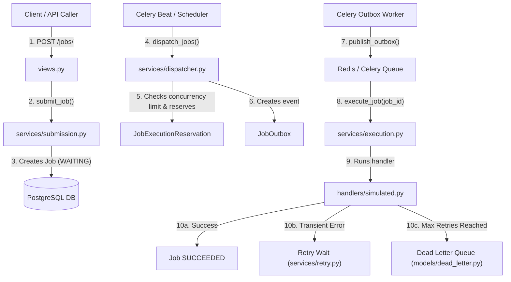

# Multi-Tenant Job Orchestrator — `jobs` App Documentation

Welcome to the code documentation for the **`jobs`** application! 

This document explains every single file in the `jobs` module in simple, human-friendly English. Every file follows the exact same structure:
1. **Purpose**: What this file does in plain words.
2. **Use Case**: A real-world example of why we need it.
3. **Key Components**: The main classes, functions, or database fields.
4. **How it Connects**: How this file talks to other parts of the system.

---

## Table of Contents
- [Architecture Overview](#architecture-overview)
- [Domain Layer (`jobs/domain/`)](#1-domain-layer-jobsdomain)
  - [state_machine.py](#jobsdomainstate_machinepy)
  - [transitions.py](#jobsdomaintransitionspy)
  - [exceptions.py](#jobsdomainexceptionspy)
- [Data Models Layer (`jobs/models/`)](#2-data-models-layer-jobsmodels)
  - [job.py](#jobsmodelsjobpy)
  - [attempt.py](#jobsmodelsattemptpy)
  - [reservation.py](#jobsmodelsreservationpy)
  - [overlap.py](#jobsmodelsoverlappy)
  - [outbox.py](#jobsmodelsoutboxpy)
  - [dead_letter.py](#jobsmodelsdead_letterpy)
  - [scheduler_state.py](#jobsmodelsscheduler_statepy)
- [Services Layer (`jobs/services/`)](#3-services-layer-jobsservices)
  - [submission.py](#jobsservicessubmissionpy)
  - [dispatcher.py](#jobsservicesdispatcherpy)
  - [execution.py](#jobsservicesexecutionpy)
  - [failure.py](#jobsservicesfailurepy)
  - [retry.py](#jobsservicesretrypy)
  - [heartbeat.py](#jobsservicesheartbeatpy)
  - [cancellation.py](#jobsservicescancellationpy)
  - [dead_letter.py](#jobsservicesdead_letterpy)
  - [outbox.py](#jobsservicesoutboxpy)
  - [overlap.py](#jobsservicesoverlappy)
  - [reconciliation.py](#jobsservicesreconciliationpy)
  - [scheduler_state.py](#jobsservicesscheduler_statepy)
- [Handlers Layer (`jobs/handlers/`)](#4-handlers-layer-jobshandlers)
  - [base.py](#jobshandlersbasepy)
  - [context.py](#jobshandlerscontextpy)
  - [registry.py](#jobshandlersregistrypy)
  - [simulated.py](#jobshandlerssimulatedpy)
- [API & Asynchronous Tasks Layer (`jobs/`)](#5-api--asynchronous-tasks-layer-jobs)
  - [views.py](#jobsviewspy)
  - [serializers.py](#jobsserializerspy)
  - [urls.py](#jobsurlspy)
  - [tasks.py](#jobstaskspy)

---

## Architecture Overview

---

## 1. Domain Layer (`jobs/domain/`)

The domain layer holds the business rules and state transition logic that dictate how a job moves through its lifecycle.

---

### [jobs/domain/state_machine.py](file:///Users/vivek/mt_jobs/jobs/domain/state_machine.py)

- **Purpose**:
  Protects the lifecycle of a job by validating that any requested state change (e.g. from `WAITING` to `QUEUED`) is legally allowed. If someone tries an illegal transition, it raises an error immediately.
- **Use Case**:
  Imagine a job is already `SUCCEEDED`. If a rogue process tries to change its status back to `EXECUTING`, this file stops it from happening and prevents data corruption.
- **Key Components**:
  - `validate_transition(current_status, new_status)`: Checks if `new_status` is in the set of allowed transitions for `current_status`. Raises `InvalidJobTransition` if it is not allowed.
- **How it Connects**:
  - Imports `ALLOWED_TRANSITIONS` from [transitions.py](file:///Users/vivek/mt_jobs/jobs/domain/transitions.py).
  - Used by services when jobs change status.

---

### [jobs/domain/transitions.py](file:///Users/vivek/mt_jobs/jobs/domain/transitions.py)

- **Purpose**:
  Acts as the single source of truth for the job state machine map. It defines a dictionary mapping each status to the allowed next statuses.
- **Use Case**:
  When you need to know: *"Can a job go directly from `WAITING` to `CANCELLED`?"* — you look at this file. The answer is yes, but it cannot go from `SUCCEEDED` to `CANCELLED`.
- **Key Components**:
  - `ALLOWED_TRANSITIONS`: A dictionary defining all valid state transitions:
    - `WAITING` &rarr; `QUEUED`, `CANCELLED`
    - `QUEUED` &rarr; `EXECUTING`, `CANCEL_REQUESTED`, `WAITING`
    - `EXECUTING` &rarr; `SUCCEEDED`, `RETRY_WAIT`, `FAILED_FINAL`, `CANCEL_REQUESTED`
    - `RETRY_WAIT` &rarr; `WAITING`, `CANCELLED`
    - `CANCEL_REQUESTED` &rarr; `CANCELLED`, `SUCCEEDED`
- **How it Connects**:
  - Uses `JobStatus` from [jobs/models/job.py](file:///Users/vivek/mt_jobs/jobs/models/job.py).
  - Read by [state_machine.py](file:///Users/vivek/mt_jobs/jobs/domain/state_machine.py).

---

### [jobs/domain/exceptions.py](file:///Users/vivek/mt_jobs/jobs/domain/exceptions.py)

- **Purpose**:
  Defines custom exception classes representing different types of job execution and state failures.
- **Use Case**:
  When a job fails because an external API is temporarily down, the handler raises `RetryableJobError`. If the input data is fundamentally broken and cannot be fixed by retrying, the handler raises `PermanentJobError`.
- **Key Components**:
  - `JobError`: Base exception for all job domain errors.
  - `RetryableJobError`: Thrown when an error is temporary (e.g., rate limit, network timeout) and the system should retry.
  - `PermanentJobError`: Thrown when an error is fatal (e.g., invalid payload, authentication rejected) and should fail immediately without retries.
  - `InvalidJobTransition`: Thrown when a job attempts an invalid state change.
- **How it Connects**:
  - Raised in handlers ([simulated.py](file:///Users/vivek/mt_jobs/jobs/handlers/simulated.py)) and caught by the execution engine ([execution.py](file:///Users/vivek/mt_jobs/jobs/services/execution.py)).

---

## 2. Data Models Layer (`jobs/models/`)

This layer defines the database tables that persist job records, execution attempts, locks, outbox events, and dead-letter queues.

---

### [jobs/models/job.py](file:///Users/vivek/mt_jobs/jobs/models/job.py)

- **Purpose**:
  The central table (`jobs`) in the database. It stores the primary details of every submitted job, such as tenant owner, status, priority, payload, timing, and error information.
- **Use Case**:
  When Tenant A submits an "AI Processing" job with Priority 1 and an idempotency key, this model creates and saves the main record that tracks its journey from creation to completion.
- **Key Components**:
  - `JobStatus`: Enum of all possible statuses (`WAITING`, `QUEUED`, `EXECUTING`, `RETRY_WAIT`, `CANCEL_REQUESTED`, `SUCCEEDED`, `FAILED_FINAL`, `CANCELLED`).
  - `JobPriority`: Priority scale from 1 (Highest) to 5 (Lowest).
  - `JobType`: Supported job categories (`REPORTS`, `DATA_PROCESSING`, `SYNCHRONIZATION`, `AI_PROCESSING`, `NOTIFICATION`).
  - `Job` Model:
    - `tenant`: Foreign key to the tenant who owns this job.
    - `idempotency_key`: Unique token per tenant ensuring duplicate HTTP requests return the original job instead of re-creating it.
    - `available_at` & `ready_since`: Timestamps for scheduled execution and fair FIFO dispatching within the same priority level.
    - `attempt_count`: How many times workers have tried to run this job.
    - Database indexes: Optimized for fast priority-based polling and dispatching.
- **How it Connects**:
  - Linked to `Tenant` model in `tenants/models.py`.
  - Referenced by attempts, reservations, locks, and dead-letter records.

---

### [jobs/models/attempt.py](file:///Users/vivek/mt_jobs/jobs/models/attempt.py)

- **Purpose**:
  Stores the execution history of every single run attempt for a job. A single job can have multiple attempts if it failed and was retried.
- **Use Case**:
  If a job failed twice due to network timeouts and succeeded on the 3rd try, this table contains 3 records detailing which worker ran each attempt, what error occurred, and how long each took.
- **Key Components**:
  - `AttemptStatus`: Enum for attempt outcome (`RUNNING`, `SUCCEEDED`, `FAILED`, `TIMED_OUT`, `ABANDONED`, `CANCELLED`).
  - `FailureType`: Categorizes failures (`TRANSIENT`, `PERMANENT`, `INFRASTRUCTURE`, `TIMEOUT`, `UNKNOWN`).
  - `JobAttempt` Model:
    - `job`: Link back to the parent Job.
    - `attempt_number`: 1, 2, 3, etc.
    - `worker_id`: Hostname or ID of the Celery worker handling this run.
    - `heartbeat_at` & `lease_expires_at`: Heartbeat timestamps to detect crashed workers.
    - `traceback` & `error_message`: Full crash diagnostic details.
- **How it Connects**:
  - Created by [execution.py](file:///Users/vivek/mt_jobs/jobs/services/execution.py) when a worker claims a job.
  - Inspected by [reconciliation.py](file:///Users/vivek/mt_jobs/jobs/services/reconciliation.py) to recover abandoned leases.

---

### [jobs/models/reservation.py](file:///Users/vivek/mt_jobs/jobs/models/reservation.py)

- **Purpose**:
  Represents an active tenant capacity slot. It guarantees that a tenant never exceeds their allowed maximum concurrent job limit (e.g. max 2 running jobs at once).
- **Use Case**:
  Tenant B is allowed 2 concurrent jobs. When job #1 and job #2 start running, each takes a reservation slot. If job #3 comes in, the dispatcher sees 2 active reservations and leaves job #3 in `WAITING` status.
- **Key Components**:
  - `JobExecutionReservation` Model:
    - `job`: One-to-One link to the reserved job.
    - `tenant`: The tenant holding the reservation.
    - `lease_token`: Unique UUID representing the reservation lease.
    - `expires_at`: Safety expiration date so dead jobs automatically free up capacity after timeout.
- **How it Connects**:
  - Created in [dispatcher.py](file:///Users/vivek/mt_jobs/jobs/services/dispatcher.py).
  - Deleted when a job completes or fails in [execution.py](file:///Users/vivek/mt_jobs/jobs/services/execution.py).

---

### [jobs/models/overlap.py](file:///Users/vivek/mt_jobs/jobs/models/overlap.py)

- **Purpose**:
  Provides resource-based locking (mutual exclusion). Prevents two jobs from touching the exact same resource (like syncing the same customer account) at the exact same time.
- **Use Case**:
  Two export jobs are scheduled for "Warehouse-42". If job #1 is executing, job #2 will wait until job #1 finishes, preventing race conditions or double-processing.
- **Key Components**:
  - `OverlapScope`: `TENANT` (locked only within that tenant) or `GLOBAL` (locked across all tenants).
  - `JobOverlapLock` Model:
    - `resource_key`: String identifying the resource (e.g. `customer_123` or `warehouse_42`).
    - `expires_at`: Lease expiration preventing permanent deadlocks if a worker crashes.
    - Unique constraints ensuring only one lock exists per resource key at any time.
- **How it Connects**:
  - Acquired in [dispatcher.py](file:///Users/vivek/mt_jobs/jobs/services/dispatcher.py) via [services/overlap.py](file:///Users/vivek/mt_jobs/jobs/services/overlap.py).
  - Released when the job finishes in [services/execution.py](file:///Users/vivek/mt_jobs/jobs/services/execution.py).

---

### [jobs/models/outbox.py](file:///Users/vivek/mt_jobs/jobs/models/outbox.py)

- **Purpose**:
  Implements the **Transactional Outbox Pattern**. It ensures that database updates and message publishing to Redis/Celery happen reliably without losing messages if a server crashes midway.
- **Use Case**:
  When a job is reserved, the database transaction writes a row in `job_outbox`. Even if the network blips before sending the message to Redis, the background outbox publisher picks it up from the database and delivers it.
- **Key Components**:
  - `OutboxEventType`: Event type (`DISPATCH_JOB`).
  - `OutboxStatus`: `PENDING` or `PUBLISHED`.
  - `JobOutbox` Model:
    - `job`: The job to be dispatched.
    - `publish_attempts`: Number of tries to send the message to the queue.
    - `last_error`: Message if publishing failed.
- **How it Connects**:
  - Written inside DB transaction by [dispatcher.py](file:///Users/vivek/mt_jobs/jobs/services/dispatcher.py).
  - Read and published to Celery workers by [services/outbox.py](file:///Users/vivek/mt_jobs/jobs/services/outbox.py).

---

### [jobs/models/dead_letter.py](file:///Users/vivek/mt_jobs/jobs/models/dead_letter.py)

- **Purpose**:
  Stores jobs that have permanently failed or exhausted all retry attempts in a **Dead Letter Queue (DLQ)** for manual inspection, debugging, and replaying.
- **Use Case**:
  A job failed 3 times because a third-party server was offline. Instead of being lost, it is moved to the DLQ table. Once the third-party server is fixed, an engineer can trigger the "Replay" API to re-run the job.
- **Key Components**:
  - `DeadLetterReason`: Reason for moving to DLQ (`RETRIES_EXHAUSTED`, `PERMANENT_FAILURE`, `HANDLER_NOT_FOUND`, `POISON_JOB`, etc.).
  - `DeadLetterStatus`: Status of DLQ entry (`OPEN`, `REPLAYED`, `DISMISSED`).
  - `DeadLetterJob` Model:
    - `job`: One-to-one link to the failed Job.
    - `replayed_job`: Link to the newly generated job if it was replayed.
    - `metadata`: Contextual debugging details.
- **How it Connects**:
  - Created by [failure.py](file:///Users/vivek/mt_jobs/jobs/services/failure.py) and [execution.py](file:///Users/vivek/mt_jobs/jobs/services/execution.py).
  - Replayed via [services/dead_letter.py](file:///Users/vivek/mt_jobs/jobs/services/dead_letter.py) through the REST API.

---

### [jobs/models/scheduler_state.py](file:///Users/vivek/mt_jobs/jobs/models/scheduler_state.py)

- **Purpose**:
  Maintains a fast snapshot of each tenant's scheduling health (how many active jobs they have running, whether they have pending work, and highest priority job waiting).
- **Use Case**:
  With 10,000 tenants in the database, the dispatcher does not need to scan millions of rows. It simply queries `tenant_scheduler_state` where `has_ready_work = True` to know exactly who needs work dispatched.
- **Key Components**:
  - `TenantSchedulerState` Model:
    - `tenant`: Primary key one-to-one link to Tenant.
    - `active_reservations`: Current number of jobs executing for this tenant.
    - `has_ready_work`: Boolean flag showing if waiting jobs exist.
    - `highest_ready_priority`: The highest priority among waiting jobs (1 to 5).
    - `last_dispatched_at`: Timestamp for round-robin fair scheduling between tenants.
- **How it Connects**:
  - Updated when jobs are submitted ([services/submission.py](file:///Users/vivek/mt_jobs/jobs/services/submission.py)) or completed ([services/execution.py](file:///Users/vivek/mt_jobs/jobs/services/execution.py)).
  - Queried by the scheduler task in [tasks.py](file:///Users/vivek/mt_jobs/jobs/tasks.py).

---

## 3. Services Layer (`jobs/services/`)

The services layer contains all business logic workflows, database transactions, locking mechanisms, and scheduling algorithms.

---

### [jobs/services/submission.py](file:///Users/vivek/mt_jobs/jobs/services/submission.py)

- **Purpose**:
  Handles the entry point for creating new jobs. It provides bulletproof idempotency so network retries and duplicate user requests never create accidental duplicate jobs.
- **Use Case**:
  A mobile client creates a job, but the HTTP response drops due to bad Wi-Fi. The mobile app automatically retries the request with the same `Idempotency-Key`. This service catches the duplicate and safely returns the existing job without creating a second one.
- **Key Components**:
  - `submit_job(...)`: Creates a `Job` inside an atomic transaction. If an `IntegrityError` is caught (due to matching `tenant` + `idempotency_key`), it fetches and returns the existing job with `created=False`.
- **How it Connects**:
  - Called by API views in [views.py](file:///Users/vivek/mt_jobs/jobs/views.py).
  - Refreshes scheduler state via [scheduler_state.py](file:///Users/vivek/mt_jobs/jobs/services/scheduler_state.py).

---

### [jobs/services/dispatcher.py](file:///Users/vivek/mt_jobs/jobs/services/dispatcher.py)

- **Purpose**:
  The traffic cop of the system. It inspects a tenant's queue, respects tenant concurrency limits, checks resource overlap locks, reserves capacity, and creates an outbox event.
- **Use Case**:
  Tenant A has 5 jobs in `WAITING` status. `dispatch_next` checks if Tenant A is already running 2 jobs. If only 1 is running, it finds the highest priority waiting job (e.g. Priority 1), checks that its resource isn't locked, reserves it, and marks it `QUEUED`.
- **Key Components**:
  - `dispatch_next(tenant_id)`: Atomically locks the tenant scheduler state using `select_for_update()`, finds top candidate jobs, acquires overlap locks, creates an execution reservation, and enqueues an outbox entry.
  - `_reserve_job(job, state, now)`: Helper that updates job status to `QUEUED`, increases `active_reservations`, and logs outbox event.
- **How it Connects**:
  - Triggered by the periodic Celery task `dispatch_jobs()` in [tasks.py](file:///Users/vivek/mt_jobs/jobs/tasks.py).
  - Uses [services/overlap.py](file:///Users/vivek/mt_jobs/jobs/services/overlap.py) to check mutual exclusion locks.

---

### [jobs/services/execution.py](file:///Users/vivek/mt_jobs/jobs/services/execution.py)

- **Purpose**:
  The core engine that runs a job inside a worker process. It claims the job, creates an attempt record, executes the registered handler, and handles completion or errors.
- **Use Case**:
  A Celery worker picks up `execute_job(job_id)`. This service calls the appropriate handler (e.g. `ReportHandler`). If the handler completes, it saves the output into `job.result` and marks the job `SUCCEEDED`.
- **Key Components**:
  - `execute(job_id)`: Main execution wrapper with try/except blocks for `RetryableJobError`, `PermanentJobError`, and unexpected crashes.
  - `claim_job(job_id)`: Atomically transitions the job status from `QUEUED` to `EXECUTING` and records a `JobAttempt`.
  - `complete_job(attempt_id, result)`: Marks the attempt and job `SUCCEEDED`, saves the result JSON, and calls `release_capacity()`.
  - `fail_job(attempt_id, exc, failure_type)`: Records failure, calculates retry backoff delays (`3s`, `5s`, `10s`), or moves to DLQ if retries are exhausted.
  - `release_capacity(job)`: Deletes reservations and overlap locks, and decrements tenant active reservations.
- **How it Connects**:
  - Called by Celery task `execute_job` in [tasks.py](file:///Users/vivek/mt_jobs/jobs/tasks.py).
  - Dispatches execution to handlers via [jobs/handlers/registry.py](file:///Users/vivek/mt_jobs/jobs/handlers/registry.py).

---

### [jobs/services/failure.py](file:///Users/vivek/mt_jobs/jobs/services/failure.py)

- **Purpose**:
  Dedicated service for classifying job failures and deciding whether a failed job should wait for retry or be permanently routed to the Dead Letter Queue.
- **Use Case**:
  When a worker encounters an error, this service checks: *"Is this error transient? Has it exceeded the maximum retry limit of 3 attempts?"* If retryable, it puts the job in `RETRY_WAIT`. If non-retryable, it creates a `DeadLetterJob`.
- **Key Components**:
  - `RETRYABLE`: Set of failure types eligible for retry (`TRANSIENT`, `INFRASTRUCTURE`, `TIMEOUT`, `UNKNOWN`).
  - `RETRY_DELAYS`: Backoff schedule dictionary `{1: 3, 2: 5, 3: 10}` (in seconds).
  - `finalize_failure(job_id, failure_type, message)`: Sets `RETRY_WAIT` with exponential backoff or `FAILED_FINAL` with DLQ creation.
  - `fail_attempt(attempt_id, exc, failure_type)`: Helper to update attempt record and finalize failure.
- **How it Connects**:
  - Used by [execution.py](file:///Users/vivek/mt_jobs/jobs/services/execution.py) and [reconciliation.py](file:///Users/vivek/mt_jobs/jobs/services/reconciliation.py).

---

### [jobs/services/retry.py](file:///Users/vivek/mt_jobs/jobs/services/retry.py)

- **Purpose**:
  Scans for jobs whose retry backoff delay timer has expired and promotes them back into the `WAITING` pool so the dispatcher can run them again.
- **Use Case**:
  A job failed at 10:00:00 with a 5-second backoff delay (`available_at = 10:00:05`). At 10:00:05, this service promotes its status from `RETRY_WAIT` back to `WAITING`.
- **Key Components**:
  - `promote_ready_retries(limit=100)`: Uses `select_for_update(skip_locked=True)` on jobs in `RETRY_WAIT` where `available_at <= now` and changes them to `WAITING`.
- **How it Connects**:
  - Called periodically by the `process_retries()` Celery task in [tasks.py](file:///Users/vivek/mt_jobs/jobs/tasks.py).

---

### [jobs/services/heartbeat.py](file:///Users/vivek/mt_jobs/jobs/services/heartbeat.py)

- **Purpose**:
  Allows long-running jobs to extend their worker lease so the system knows the worker is still alive and healthy.
- **Use Case**:
  A heavy AI processing job runs for 10 minutes. Every 60 seconds, the job calls `context.heartbeat()`. This service extends `lease_expires_at` by 5 minutes, preventing the reaper from marking it abandoned.
- **Key Components**:
  - `LEASE_SECONDS`: Standard lease extension window (300 seconds / 5 minutes).
  - `heartbeat(attempt_id)`: Updates `heartbeat_at` and `lease_expires_at` on both `JobAttempt` and `JobExecutionReservation`.
- **How it Connects**:
  - Called by `JobContext.heartbeat()` in [handlers/context.py](file:///Users/vivek/mt_jobs/jobs/handlers/context.py).

---

### [jobs/services/cancellation.py](file:///Users/vivek/mt_jobs/jobs/services/cancellation.py)

- **Purpose**:
  Safely cancels jobs at any point in their lifecycle while keeping system capacity balanced.
- **Use Case**:
  A user accidentally enqueued a massive batch of reports and clicks "Cancel". If the job is `WAITING`, it immediately cancels. If it is already `EXECUTING`, it marks `CANCEL_REQUESTED` so the worker terminates cleanly.
- **Key Components**:
  - `cancel_job(job_id)`:
    - If `WAITING` or `RETRY_WAIT` &rarr; marks `CANCELLED`.
    - If `QUEUED` &rarr; marks `CANCELLED` and releases capacity slot.
    - If `EXECUTING` &rarr; marks `CANCEL_REQUESTED`.
    - If `SUCCEEDED` or `FAILED_FINAL` &rarr; leaves unchanged (terminal states).
- **How it Connects**:
  - Exposed via the REST API view `JobCancelView` in [views.py](file:///Users/vivek/mt_jobs/jobs/views.py).

---

### [jobs/services/dead_letter.py](file:///Users/vivek/mt_jobs/jobs/services/dead_letter.py)

- **Purpose**:
  Provides dead-letter replay functionality. It allows failed jobs in the DLQ to be safely re-submitted as brand-new jobs.
- **Use Case**:
  A bug in the reporting engine was fixed and deployed. The ops team triggers replay on the 50 dead-lettered report jobs. This service generates new fresh jobs with the original payloads and marks the DLQ records as `REPLAYED`.
- **Key Components**:
  - `replay_dead_letter(dead_letter_id)`: Clones the original job parameters into a new `Job` with `WAITING` status, marks the DLQ entry as `REPLAYED`, links `replayed_job`, and refreshes the tenant's scheduler state.
- **How it Connects**:
  - Called by the `DeadLetterReplayView` in [views.py](file:///Users/vivek/mt_jobs/jobs/views.py).

---

### [jobs/services/outbox.py](file:///Users/vivek/mt_jobs/jobs/services/outbox.py)

- **Purpose**:
  Implements the outbox publisher daemon that reads pending dispatch events from the database and fires them into Celery.
- **Use Case**:
  When a job is queued, an outbox row is stored. This service queries `status = PENDING`, invokes `execute_job.delay(job_id)`, and marks the event `PUBLISHED`. If Celery/Redis is unreachable, it logs the error and retries next cycle.
- **Key Components**:
  - `publish_pending(limit=100)`: Finds pending outbox events ready to be published.
  - `publish_event(event_id)`: Enqueues `execute_job.delay()` with Celery and updates status to `PUBLISHED`.
- **How it Connects**:
  - Called periodically by `publish_outbox()` Celery task in [tasks.py](file:///Users/vivek/mt_jobs/jobs/tasks.py).

---

### [jobs/services/overlap.py](file:///Users/vivek/mt_jobs/jobs/services/overlap.py)

- **Purpose**:
  Manages acquiring and releasing resource-level locks to ensure mutually exclusive job execution.
- **Use Case**:
  Job A and Job B both target database partition `shard_east`. Job A acquires the lock via `acquire_overlap()`. Job B fails to acquire it and is skipped by the dispatcher until Job A calls `release_overlaps()`.
- **Key Components**:
  - `acquire_overlap(job, resource_key, scope)`: Attempts to insert a `JobOverlapLock`. Returns lock object if successful or `None` if already locked (via database constraint).
  - `release_overlaps(job)`: Deletes all locks held by the given job.
- **How it Connects**:
  - Used in [dispatcher.py](file:///Users/vivek/mt_jobs/jobs/services/dispatcher.py) (during dispatch) and [execution.py](file:///Users/vivek/mt_jobs/jobs/services/execution.py) (upon completion/failure).

---

### [jobs/services/reconciliation.py](file:///Users/vivek/mt_jobs/jobs/services/reconciliation.py)

- **Purpose**:
  The self-healing "reaper" process. It finds zombie jobs whose workers crashed or lost power without finishing, cleans them up, and re-queues stuck reservations.
- **Use Case**:
  A physical server running a Celery worker loses power midway through processing Job 100. Job 100's lease expires after 5 minutes. This service finds the expired attempt, marks it `ABANDONED`, and re-queues or fails the job.
- **Key Components**:
  - `reconcile_expired(limit=100)`: Finds running attempts with `lease_expires_at < now` and cleans them up.
  - `reconcile_attempt(attempt_id)`: Sets attempt to `ABANDONED` with failure type `INFRASTRUCTURE` and triggers failure recovery.
  - `reconcile_queued(now, limit)` & `recover_queued(job_id)`: Recovers jobs stuck in `QUEUED` status whose dispatch outbox message never arrived at a worker.
- **How it Connects**:
  - Runs in recovery testing and can be scheduled as a background cleanup cron/task.

---

### [jobs/services/scheduler_state.py](file:///Users/vivek/mt_jobs/jobs/services/scheduler_state.py)

- **Purpose**:
  Calculates and caches the scheduling readiness indicators for a tenant in `TenantSchedulerState`.
- **Use Case**:
  Whenever a job is submitted, retried, or completed, this service recalculates whether the tenant has waiting jobs (`has_ready_work`), what their highest priority is, and when the next scheduled job is ready.
- **Key Components**:
  - `refresh_scheduler_state(tenant_id)`: Queries waiting jobs for the tenant, finds the earliest available and highest priority, and updates `TenantSchedulerState`.
- **How it Connects**:
  - Called after job submission ([views.py](file:///Users/vivek/mt_jobs/jobs/views.py)), after dead-letter replay ([services/dead_letter.py](file:///Users/vivek/mt_jobs/jobs/services/dead_letter.py)), and during dispatching.

---

## 4. Handlers Layer (`jobs/handlers/`)

The handlers layer implements the actual business logic for each job type (e.g. Reports, Data Processing, AI, Sync).

---

### [jobs/handlers/base.py](file:///Users/vivek/mt_jobs/jobs/handlers/base.py)

- **Purpose**:
  Defines the abstract base interface that all job handlers must adhere to.
- **Use Case**:
  Ensures every developer writing a new job type (e.g. Email Sender, PDF Generator) creates a class with a standard `execute(payload, context)` method.
- **Key Components**:
  - `BaseJobHandler(ABC)`: Abstract class requiring child classes to implement `execute(self, payload, context)`.
- **How it Connects**:
  - Inherited by all concrete handlers in [simulated.py](file:///Users/vivek/mt_jobs/jobs/handlers/simulated.py).

---

### [jobs/handlers/context.py](file:///Users/vivek/mt_jobs/jobs/handlers/context.py)

- **Purpose**:
  Provides runtime context to the running handler, allowing handlers to access metadata and send heartbeats to the orchestrator.
- **Use Case**:
  An AI handler running a 15-minute inference job receives `context` and periodically calls `context.heartbeat()` in a loop so the orchestrator knows the job is progressing normally.
- **Key Components**:
  - `JobContext`: Holds references to `self.job` and `self.attempt`.
  - `JobContext.heartbeat()`: Sends a heartbeat signal for the current attempt.
- **How it Connects**:
  - Instantiated by [services/execution.py](file:///Users/vivek/mt_jobs/jobs/services/execution.py) and passed into `handler.execute()`.

---

### [jobs/handlers/registry.py](file:///Users/vivek/mt_jobs/jobs/handlers/registry.py)

- **Purpose**:
  Maintains a dynamic registry of available job handlers using a clean decorator pattern (`@register`).
- **Use Case**:
  When a job with `job_type="REPORTS"` arrives, the execution engine calls `get_handler("REPORTS")`, which instantly retrieves the registered `ReportHandler` instance.
- **Key Components**:
  - `@register(job_type)`: Class decorator that registers a handler class in the internal registry dictionary.
  - `get_handler(job_type)`: Looks up and returns the handler instance for a given job type string; raises `ValueError` if missing.
- **How it Connects**:
  - Handlers register themselves in [simulated.py](file:///Users/vivek/mt_jobs/jobs/handlers/simulated.py).
  - Queried by [services/execution.py](file:///Users/vivek/mt_jobs/jobs/services/execution.py).

---

### [jobs/handlers/simulated.py](file:///Users/vivek/mt_jobs/jobs/handlers/simulated.py)

- **Purpose**:
  Provides realistic simulated implementations for all required project job types (Reports, Data Processing, Sync, AI Processing, Notifications, Failure & Overlap testing).
- **Use Case**:
  Used to simulate real-world workloads with realistic variable delays, simulated transient failures, and permanent error conditions for local demos and integration testing.
- **Key Components**:
  - `ReportHandler`: Simulates report generation (takes 3–8 seconds).
  - `DataProcessingHandler`: Simulates large ETL/batch processing (takes 5–12 seconds).
  - `SyncHandler`: Simulates third-party synchronization (takes 4–10 seconds).
  - `AIHandler`: Simulates model inference (takes 8–15 seconds).
  - `NotificationHandler`: Simulates email/SMS delivery (takes 1–3 seconds).
  - `TemporaryFailureHandler`: Simulates transient failure that fails for N attempts before succeeding.
  - `PermanentFailureHandler`: Simulates a non-recoverable error.
  - `OverlapHandler`: Simulates work on a locked shared resource.
- **How it Connects**:
  - Decorated with `@register` and called dynamically by [services/execution.py](file:///Users/vivek/mt_jobs/jobs/services/execution.py).

---

## 5. API & Asynchronous Tasks Layer (`jobs/`)

This layer exposes the REST API endpoints to external clients and defines the Celery background tasks that drive the asynchronous event loop.

---

### [jobs/views.py](file:///Users/vivek/mt_jobs/jobs/views.py)

- **Purpose**:
  Contains the Django REST Framework (DRF) API views that handle client HTTP requests.
- **Use Case**:
  Clients interact with these endpoints to create jobs, check execution status, view attempt history, cancel active jobs, and inspect/replay dead-lettered jobs.
- **Key Components**:
  - `JobListCreateView` (`GET /jobs/`, `POST /jobs/`): Lists jobs and handles idempotent job submission. Accepts `Idempotency-Key` HTTP header.
  - `JobDetailView` (`GET /jobs/<pk>/`): Returns status, result, and metadata of a single job.
  - `JobAttemptListView` (`GET /jobs/<job_id>/attempts/`): Returns all historical attempt records for a job.
  - `JobCancelView` (`POST /jobs/<pk>/cancel/`): Cancels a job.
  - `DeadLetterListView` (`GET /dead-letters/`): Lists all dead-lettered jobs.
  - `DeadLetterDetailView` (`GET /dead-letters/<pk>/`): Inspects a dead-letter record.
  - `DeadLetterReplayView` (`POST /dead-letters/<pk>/replay/`): Replays a dead-lettered job.
- **How it Connects**:
  - Uses serializers from [serializers.py](file:///Users/vivek/mt_jobs/jobs/serializers.py).
  - Calls services in [submission.py](file:///Users/vivek/mt_jobs/jobs/services/submission.py), [cancellation.py](file:///Users/vivek/mt_jobs/jobs/services/cancellation.py), and [dead_letter.py](file:///Users/vivek/mt_jobs/jobs/services/dead_letter.py).

---

### [jobs/serializers.py](file:///Users/vivek/mt_jobs/jobs/serializers.py)

- **Purpose**:
  Converts complex Django model instances to and from JSON format, and handles request validation.
- **Use Case**:
  When a client sends JSON `{"job_type": "reports", "priority": 1, "payload": {}}`, this serializer normalizes the job type to uppercase `REPORTS`, validates the fields, and formats the response JSON.
- **Key Components**:
  - `JobSerializer`: Normalizes `job_type` string formatting and handles `Job` model serialization.
  - `JobAttemptSerializer`: Serializes `JobAttempt` fields.
  - `DeadLetterJobSerializer`: Serializes `DeadLetterJob` fields.
  - `JobExecutionReservationSerializer`, `JobOverlapLockSerializer`, `JobOutboxSerializer`, `TenantSchedulerStateSerializer`: Model serializers for admin and internal state inspection.
- **How it Connects**:
  - Used by API views in [views.py](file:///Users/vivek/mt_jobs/jobs/views.py).

---

### [jobs/urls.py](file:///Users/vivek/mt_jobs/jobs/urls.py)

- **Purpose**:
  Defines the URL routing configuration for the `jobs` application REST API.
- **Use Case**:
  Maps HTTP endpoints like `/jobs/`, `/jobs/<id>/cancel/`, and `/dead-letters/<id>/replay/` to their corresponding DRF view classes.
- **Key Components**:
  - `/jobs/` &rarr; `JobListCreateView`
  - `/jobs/<uuid:pk>/` &rarr; `JobDetailView`
  - `/jobs/<uuid:job_id>/attempts/` &rarr; `JobAttemptListView`
  - `/jobs/<uuid:pk>/cancel/` &rarr; `JobCancelView`
  - `/dead-letters/` &rarr; `DeadLetterListView`
  - `/dead-letters/<uuid:pk>/` &rarr; `DeadLetterDetailView`
  - `/dead-letters/<uuid:pk>/replay/` &rarr; `DeadLetterReplayView`
- **How it Connects**:
  - Included in the main root URL router in `config/urls.py`.

---

### [jobs/tasks.py](file:///Users/vivek/mt_jobs/jobs/tasks.py)

- **Purpose**:
  Defines the Celery background tasks that power the asynchronous processing loop (job execution, dispatching, retry promotions, and outbox publishing).
- **Use Case**:
  Runs in the background Celery workers and Beat scheduler to keep the orchestrator humming without blocking the web server.
- **Key Components**:
  - `execute_job(job_id)`: Celery task configured with `acks_late=True` and `reject_on_worker_lost=True` that runs a specific job.
  - `dispatch_jobs()`: Finds tenants with ready work and calls `dispatch_next(tenant_id)`.
  - `publish_outbox()`: Flushes pending outbox events to the Celery broker.
  - `process_retries()`: Promotes ready retry-waiting jobs back to waiting.
- **How it Connects**:
  - Triggers services in [dispatcher.py](file:///Users/vivek/mt_jobs/jobs/services/dispatcher.py), [execution.py](file:///Users/vivek/mt_jobs/jobs/services/execution.py), [outbox.py](file:///Users/vivek/mt_jobs/jobs/services/outbox.py), and [retry.py](file:///Users/vivek/mt_jobs/jobs/services/retry.py).
